# Universidad de las Fuerzas Armadas ESPE

**Proyecto de Integración Curricular — Arquitectura de Microservicios**

**Autores:** Jairo Bonilla, Julio Viche, Reishel Tipán

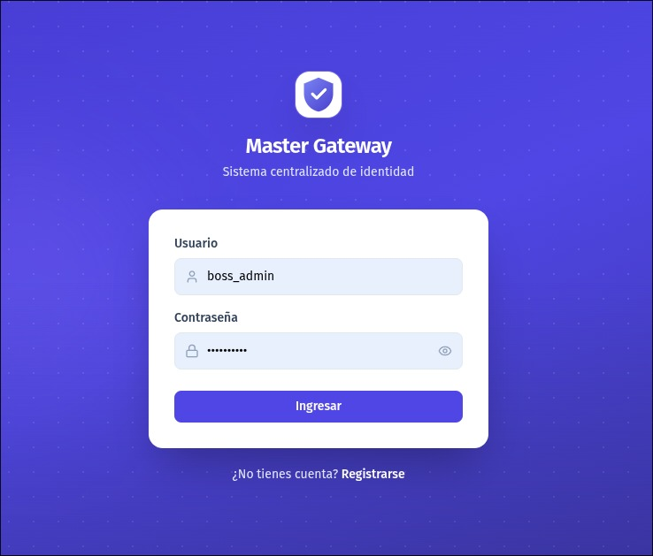

---

## ⚠️ Importante

Los pipelines de CI/CD estan configurados para ejecutarse automaticamente segun el nombre y el destino de la rama. No cualquier rama creada con un nombre arbitrario disparara un pipeline. Si un desarrollador crea una rama como `git checkout -b rama-inventada` y hace push, el workflow simplemente no se ejecutara.

Solo las ramas que siguen la convencion explicada en la seccion de **Convencion de Ramas** activaran los pipelines correspondientes. Esta restriccion evita ejecuciones innecesarias y garantiza que solo el codigo que sigue el flujo definido pase por los controles de calidad y seguridad.

---

## Contenido

1. [Descripcion del Proyecto](#1-descripcion-del-proyecto)
2. [Arquitectura](#2-arquitectura)
3. [Stack Tecnologico](#3-stack-tecnologico)
4. [Estructura del Proyecto](#4-estructura-del-proyecto)
5. [Convencion de Ramas](#5-convencion-de-ramas)
6. [Pipelines CI/CD](#6-pipelines-cicd)
7. [Como Ejecutar](#7-como-ejecutar)
8. [Variables de Entorno](#8-variables-de-entorno)
9. [Seguridad](#9-seguridad)

---

## 1. Descripcion del Proyecto

**Master Gateway** es un API Gateway que actua como puerta de entrada unica para un ecosistema de microservicios. Centraliza la autenticacion, la autorizacion y el enrutamiento, y proporciona un panel administrativo web desde el cual se gestionan todos los componentes del sistema.

Cada microservicio hijo se registra dinamicamente en el Service Registry integrado en el gateway. Pueden ser desarrollados en cualquier tecnologia, desplegarse de forma independiente y escalarse segun sus propias necesidades. La comunicacion entre el gateway y los microservicios se realiza mediante tokens JWT.

El proyecto se compone de dos artefactos principales:

- **Backend:** Java 21 con Spring Boot. Implementa la logica de negocio, la autenticacion JWT en dos fases, 25 permisos granulares y un arbol de menus dinamico configurable por rol.
- **Frontend:** React 19 con TypeScript. Consume la API y ofrece una interfaz grafica de administracion para gestionar usuarios, roles, modulos, menus y servicios.

Adicionalmente, el sistema incluye un pipeline de seguridad basado en machine learning que analiza el codigo modificado en cada Pull Request para detectar vulnerabilidades antes de la integracion, junto con un flujo completo de CI/CD mediante GitHub Actions y ArgoCD para el despliegue automatizado.

### Lo que se puede gestionar desde el panel

- **Usuarios** — Creacion, edicion, eliminacion y asignacion de roles
- **Roles y Permisos** — 25 permisos granulares (CREAR, LEER, ACTUALIZAR, ELIMINAR, ASIGNAR por dominio)
- **Modulos** — Agrupacion logica de funcionalidades del sistema
- **Menus Dinamicos** — Arbol de navegacion configurable por rol. Cada nodo tiene una ruta interna y opcionalmente una URL externa para renderizar en iframe
- **Service Registry** — Registro de microservicios hijos con URL base, modo de validacion JWT y clave publica

---

## 2. Arquitectura

### Diagrama de Arquitectura

El sistema sigue una arquitectura de microservicios donde el Master Gateway es el punto de entrada unico. Los microservicios hijos se conectan al gateway, que les provee autenticacion y autorizacion centralizada.

```
  Usuario/Navegador
         |
         v
  +---------------------------------------------+
  |           Master Gateway                     |
  |  +---------------------------------------+  |
  |  |   Frontend (React + TypeScript)       |  |
  |  |   Servido por Nginx                   |  |
  |  +------------------+--------------------+  |
  |                     | HTTP/JSON             |
  |  +------------------v--------------------+  |
  |  |   Backend (Spring Boot + Java 21)     |  |
  |  |                                       |  |
  |  |   Auth     Users    Roles   Modules   |  |
  |  |   Menus    Service  Permisos          |  |
  |  |   Registry                            |  |
  |  +------------------+--------------------+  |
  |                     | JDBC                  |
  |  +------------------v--------------------+  |
  |  |   PostgreSQL 17                       |  |
  |  +---------------------------------------+  |
  +---------------------------------------------+
         |                              |
         | JWT (simetrico o asimetrico) | iframe o llamada API
         v                              v
  +------------------+      +----------------------+
  | Microservicio A  |      |  Microservicio B     |
  | (Java, Python,   | ...  |  (cualquier stack)   |
  |  Node, etc.)     |      |                      |
  +------------------+      +----------------------+
```

**Despliegue:** Las imagenes Docker se publican en Docker Hub y ArgoCD sincroniza automaticamente los manifiestos del repositorio GitOps para desplegar los cambios en el cluster.

### Arquitectura Hexagonal (Ports & Adapters)

El backend implementa el patron de arquitectura hexagonal. El nucleo del negocio no sabe nada sobre la base de datos, ni sobre HTTP, ni sobre JWT. Esas son decisiones de infraestructura que se conectan a traves de interfaces llamadas puertos.

| Capa | Que contiene | Depende de |
|------|-------------|------------|
| **Dominio** | Entidades de negocio (Usuario, Rol, MenuNode) e interfaces de salida | Nada. Es puro Java |
| **Aplicacion** | Casos de uso (servicios que orquestan la logica) | Solo del dominio |
| **Infraestructura** | Controladores REST, repositorios JPA, emision JWT, BCrypt | De las interfaces del dominio |

**Ejemplo concreto:** Cuando alguien llama a `POST /api/users`, el flujo es:

1. El **controlador REST** recibe la peticion HTTP
2. Llama al **caso de uso** `CreateUserUseCase` (interfaz en aplicacion)
3. El **servicio** `CreateUserService` implementa la logica: verifica permisos, valida datos unicos, hashea la contrasena
4. Para persistir, usa el **puerto de salida** `UserRepositoryPort` (interface en dominio)
5. El **adaptador** `UserRepositoryAdapter` (en infraestructura) ejecuta la consulta JPA

**Beneficio:** cada capa se prueba de forma aislada. Los servicios se prueban con mocks de los puertos, sin base de datos ni HTTP.

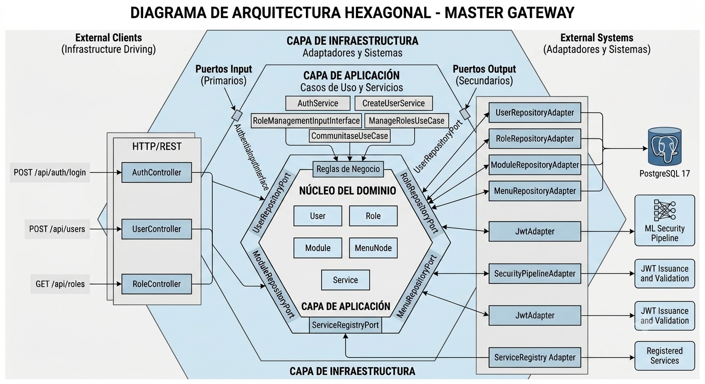

---

## 3. Stack Tecnologico

| Componente | Tecnologia |
|-----------|-----------|
| Backend | Java 21, Spring Boot 3, Spring Security, Spring Data JPA, Hibernate |
| Base de Datos | PostgreSQL 17, HikariCP |
| Autenticacion | JWT (HMAC-SHA256 y RSA-2048), BCrypt, Argon2 |
| Frontend | React 19, TypeScript, Vite, Tailwind CSS, React Router |
| Proxy | Nginx |
| Contenedores | Docker, Docker Compose |
| CI/CD | GitHub Actions, Docker Hub, ArgoCD, GitOps |
| Calidad de Codigo | SonarCloud |
| Seguridad con ML | Python, scikit-learn, dataset CVEfixes |
| Notificaciones | Telegram Bot |

---

## 4. Estructura del Proyecto

```
microservices-project/
│
├── master-gateway/                   Backend Spring Boot
│   ├── src/main/java/.../
│   │   ├── contexts/                 Modulos del negocio
│   │   │   ├── auth/                 Autenticacion
│   │   │   ├── identity/             Usuarios y roles
│   │   │   ├── menu/                 Arbol de menus
│   │   │   ├── module/               Modulos
│   │   │   └── service-registry/     Registro de microservicios
│   │   └── shared/                   Codigo compartido
│   ├── Dockerfile
│   ├── pom.xml
│   └── endpoints.md                  Documentacion detallada de la API
│
├── master-gateway-front/             Frontend React
│   ├── src/
│   │   ├── pages/                    Pantallas del panel
│   │   ├── components/               Componentes reutilizables
│   │   ├── navigation/               Rutas y navegacion
│   │   ├── api/                      Clientes HTTP
│   │   └── context/                  Contextos de React
│   ├── Dockerfile
│   ├── nginx.conf
│   └── package.json
│
├── ci/                               Pipeline de seguridad con ML
│   ├── security_pipeline.py          Orquestador
│   ├── diff_extractor.py             Extrae fragmentos del diff
│   ├── feature_extractor.py          Calcula caracteristicas
│   ├── security_gate.py              Clasificador ML
│   ├── notify.py                     Notificaciones Telegram
│   └── tests.py                      Pruebas del pipeline
│
├── modelo/                           Modelo de ML
│   ├── train_model.py                Entrenamiento
│   ├── extract_juliet.py             Procesamiento del dataset
│   └── model_artifacts/              Artefactos del modelo entrenado
│
├── .github/workflows/                Pipelines CI/CD
│   ├── feature-pipeline.yml
│   ├── integration-pipeline.yml
│   └── deploy-pipeline.yml
│
├── docker-compose.yml                Orquestacion de contenedores
└── .env.example                      Plantilla de variables de entorno
```

---

## 5. Convencion de Ramas

Para que los pipelines se ejecuten correctamente, las ramas deben seguir esta convencion de nombres. Cualquier rama que no cumpla con estos prefijos no disparara ningun workflow.

| Prefijo | Se ejecuta pipeline | Uso |
|---------|-------------------|-----|
| `feature/*` | ✅ Si, en cada push | Nuevas funcionalidades |
| `bugfix/*` | ✅ Si, en cada push | Correccion de errores |
| `hotfix/*` | ✅ Si, en cada push | Parches urgentes |
| `dev` | ✅ Si, en cada push | Integracion continua + deploy automatico |
| `main` | ❌ No por push | Solo recibe PRs desde dev |
| Cualquier otra | ❌ Sin pipeline | No dispara nada |

**Regla de oro:** `feature/*` o `bugfix/*` o `hotfix/*` → PR a `dev` → merge a `dev` → PR de `dev` a `main`

### Flujo paso a paso

1. El desarrollador crea una rama desde `dev`: `git checkout -b feature/mi-funcionalidad dev`
2. Desarrolla y hace push → se dispara el **Feature Pipeline** (build y tests rapidos)
3. Abre un Pull Request hacia `dev` → se dispara el **Integration Pipeline** (SonarCloud + escaneo ML + Telegram)
4. Si el PR esta en Draft, el pipeline se salta build y test para ahorrar recursos
5. Tras aprobacion y merge a `dev` → se dispara el **Deploy Pipeline** completo
6. Para llevar a `main`: abrir PR desde `dev` hacia `main`. El pipeline valida que el origen sea `dev`
7. Tras merge a `main`, no hay deploy automatico

---

## 6. Pipelines CI/CD

### Feature Pipeline

**Archivo:** `.github/workflows/feature-pipeline.yml`

Se ejecuta en cada push a ramas `feature/*`, `bugfix/*` o `hotfix/*`. Proporciona retroalimentacion rapida al desarrollador: saber en minutos si el codigo compila y las pruebas pasan, antes de abrir el Pull Request.

**Jobs:**
- `build-and-test` — Compila backend (Maven + Java 21) y construye frontend (Node 22 + npm). Corre en paralelo.

**Evidencia:**
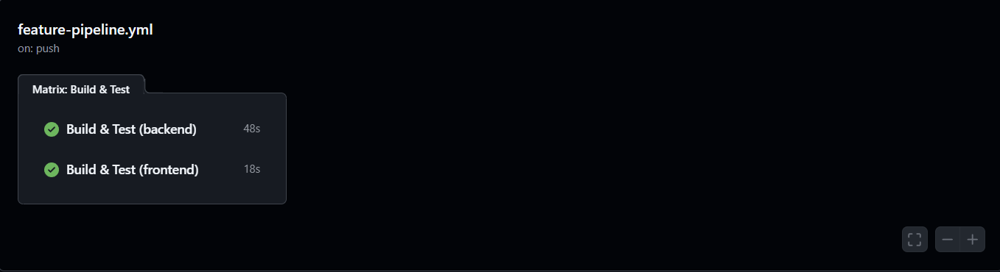

---

### Integration Pipeline

**Archivo:** `.github/workflows/integration-pipeline.yml`

Se ejecuta en Pull Requests hacia `dev` o `main`. Es el gate obligatorio para mergear. No despliega nada, solo valida.

**Jobs:**
1. `validate-branch-source` — Verifica que los PRs a `main` solo vengan de `dev`. Si alguien intenta un PR desde `feature/xyz` a `main`, falla con un mensaje claro.
2. `build-and-test` — Compila y ejecuta pruebas. Se salta si el PR es Draft.
3. `sonarcloud-scan` — Analiza calidad con SonarCloud. Verifica el Quality Gate.
4. `sast-ml-scan` — Pipeline de seguridad con ML: extrae fragmentos del diff, calcula caracteristicas y clasifica con modelo entrenado en CVEfixes.
5. `telegram-notify` — Notifica el resultado de cada fase por Telegram.

**Evidencias:**
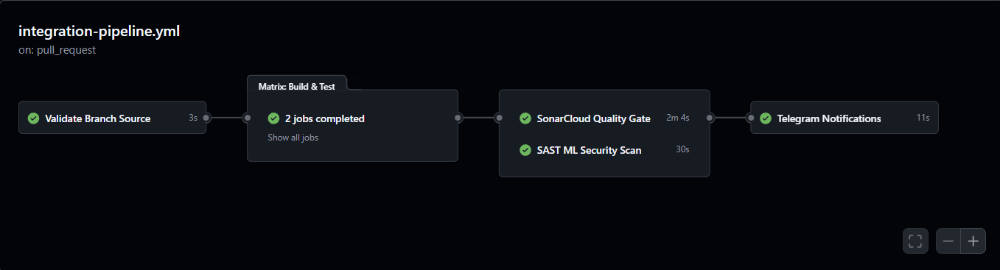
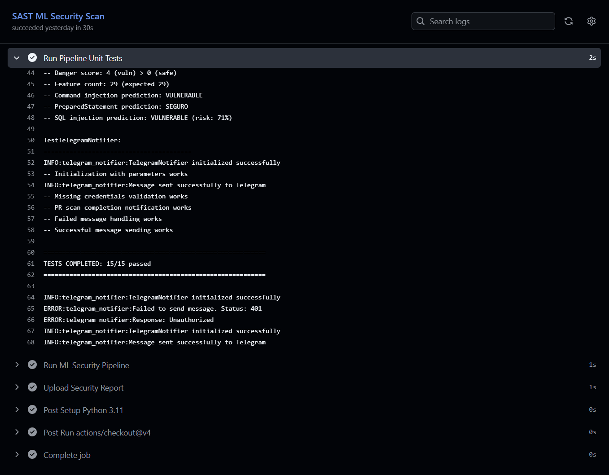

---

### Deploy Pipeline

**Archivo:** `.github/workflows/deploy-pipeline.yml`

Se ejecuta en push a `dev` (despues de un merge aprobado). Despliega el codigo al ambiente de desarrollo.

**Jobs:**
1. `build-and-test` — Revalida el merge commit
2. `sonarcloud-scan` — Calidad + cobertura
3. `sast-ml-scan` — Escaneo de seguridad
4. `docker-build-push` — Construye imagenes Docker y las publica en Docker Hub con el SHA del commit como tag
5. `gitops-deploy` — Actualiza los archivos `patch-image.yaml` en el repositorio GitOps. ArgoCD detecta el cambio y sincroniza automaticamente el nuevo manifiesto en el cluster
6. `telegram-notify` — Notifica el resultado completo

**Evidencias:**
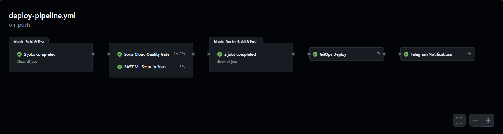
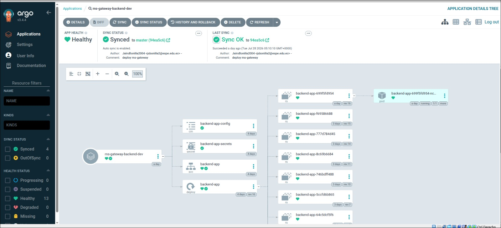
<p align="center">
       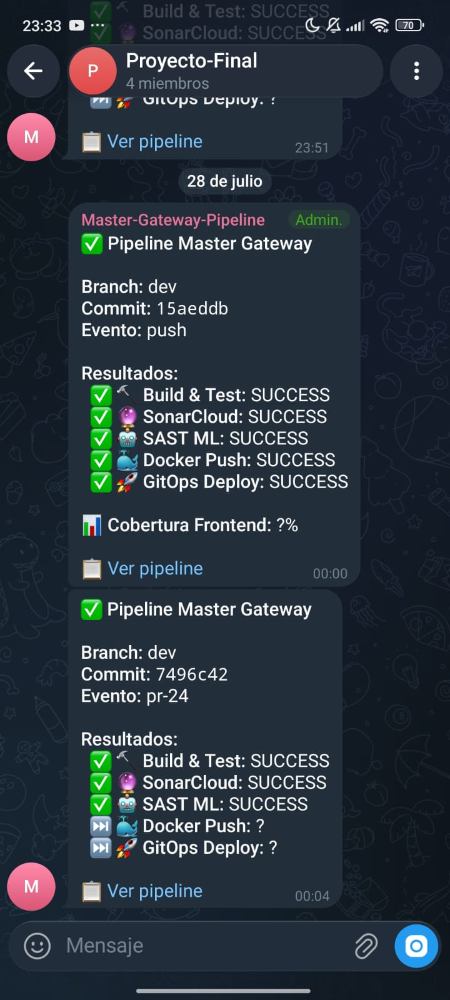
</p>

**Evidencias complementarias del despliegue:**
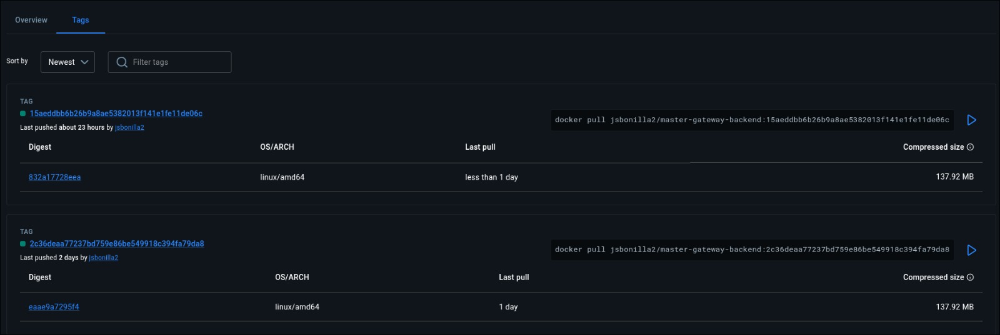
*Publicación de la imagen del backend con el SHA del commit como tag en Docker Hub.*

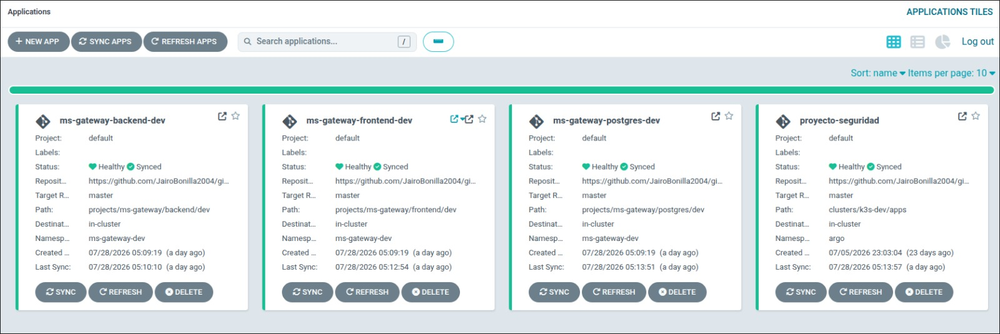
*Vista general de las aplicaciones gestionadas por ArgoCD en el clúster.*

---

## 7. Como Ejecutar

### Requisitos

- Docker y Docker Compose instalados
- Puertos 80 y 8080 disponibles (o configurar alternativos en `.env`)

### Pasos

**1. Clonar y configurar**

```bash
git clone <url-del-repositorio>
cd microservices-project
cp .env.example .env
```

Editar `.env` y completar al menos `JWT_SECRET`. Para generar un valor seguro:

```bash
openssl rand -base64 48
```

**2. Iniciar servicios**

```bash
docker compose up -d
```

Esto construye las imagenes (si es primera vez) e inicia los tres contenedores en orden:

| Servicio | Contenedor | Puerto | Depende de |
|----------|-----------|--------|-----------|
| PostgreSQL | `master-gateway-db` | 5432 | — |
| Backend | `master-gateway-api` | 8080 | PostgreSQL saludable |
| Frontend | `master-gateway-front` | 80 | Backend saludable |

**3. Acceder**

- **Frontend:** `http://localhost:80`
- **API:** `http://localhost:8080`

**Verificacion operativa (complementaria):**
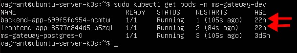
*Confirmación de que los pods del entorno de desarrollo quedaron en estado Running después del despliegue.*

### Primer inicio

Con BD vacia, el sistema crea automaticamente:
- Rol **ADMIN** con los 25 permisos del sistema
- Usuario **boss_admin** con credenciales predefinidas

### Detener

```bash
docker compose down
```

Para eliminar tambien los volumenes (datos de BD):

```bash
docker compose down -v
```

---

## 8. Variables de Entorno

El archivo `.env` en la raiz contiene todas las variables necesarias. Se agrupan en cuatro categorias.

### 🔐 Seguridad y Autenticacion

| Variable | Obligatorio | Descripcion |
|----------|-------------|-------------|
| `JWT_SECRET` | Si | Clave HMAC-SHA256. Minimo 32 caracteres. Generar con `openssl rand -base64 48` |
| `JWT_PRIVATE_KEY_PEM` | Solo si `JWT_MODE=asymmetric` | Llave privada RSA en PEM |
| `JWT_PUBLIC_KEY_PEM` | Solo si `JWT_MODE=asymmetric` | Llave publica RSA en PEM |
| `JWT_MODE` | No | `direct` (simetrico) o `asymmetric` (por defecto `direct`) |
| `HASH_ALGORITHM` | No | `argon2` o `bcrypt` (por defecto `argon2`) |

### 🗄️ Base de Datos

| Variable | Default | Descripcion |
|----------|---------|-------------|
| `DB_NAME` | `master_gateway` | Nombre de la BD |
| `DB_USER` | `postgres` | Usuario |
| `DB_PASSWORD` | `changeme` | Contrasena |
| `DB_PORT` | `5432` | Puerto |
| `DDL_AUTO` | `validate` | En produccion usar `validate`. En desarrollo `update` |

### ⚙️ Aplicacion y Logging

| Variable | Default | Descripcion |
|----------|---------|-------------|
| `SPRING_PROFILES_ACTIVE` | `prod` | Perfil (`prod` o `dev`) |
| `LOG_LEVEL` | `WARN` | Nivel de logging raiz |
| `GATEWAY_LOG_LEVEL` | `INFO` | Nivel del paquete del proyecto |
| `SHOW_SQL` | `false` | Mostrar SQL en consola |
| `ADMIN_SEED_PASSWORD` | (vacio) | Contrasena del admin inicial. Si se omite, se genera aleatoria |

### 🖥️ Frontend

| Variable | Default | Descripcion |
|----------|---------|-------------|
| `FRONT_PORT` | `80` | Puerto del contenedor frontend |
| `VITE_API_URL` | `/api` | URL base de la API. Si frontend y API estan en mismo dominio, usar `/api` |

---

## 9. Seguridad

### Autenticacion en dos fases

El login se divide en dos pasos para limitar el impacto de un token comprometido:

1. El usuario ingresa credenciales y recibe un `TEMP_TOKEN` (5 minutos). Solo permite seleccionar rol.
2. Al seleccionar el rol, se emite `ACCESS_TOKEN` (15 minutos) + `REFRESH_TOKEN` (7 dias). El access token contiene los permisos del usuario.

### Rate Limiting

Los endpoints de login y registro tienen un limite de **5 intentos por minuto por IP**. Al superarlo, el servidor responde **HTTP 429** con encabezado `Retry-After`.

### Proteccion de contraseñas

- Se almacenan con **BCrypt** (costo 12) o **Argon2**
- Nunca se devuelven en respuestas de la API
- El mensaje de error es generico ("Credenciales invalidas") para usuarios inexistentes y contrasenas incorrectas (recomendacion OWASP)

### Control de acceso

El sistema tiene **25 permisos** en 5 dominios:

| Dominio | Permisos |
|---------|----------|
| USERS | CREATE, READ, UPDATE, DELETE, ASSIGN_ROLE, REVOKE_ROLE |
| ROLES | CREATE, READ, UPDATE, DELETE, ASSIGN_USERS |
| MODULES | CREATE, READ, UPDATE, DELETE, ASSIGN |
| MENUS | CREATE, READ, UPDATE, DELETE, ASSIGN |
| SERVICES | CREATE, READ, UPDATE, DELETE |

Cada endpoint verifica el permiso requerido de forma programatica en el servicio, no con anotaciones. Esto centraliza la autorizacion y facilita el mantenimiento.

### Soporte para microservicios externos

Los microservicios hijos pueden validar tokens JWT sin compartir la clave secreta del gateway. Se registran en el Service Registry con su modo de validacion:

- **DIRECT** — Misma clave HMAC que el gateway
- **ASYMMETRIC** — RSA-2048: el gateway firma con su llave privada, el microservicio valida con la llave publica registrada

Los microservicios llaman a `POST /api/internals/validate-token` del gateway para validar tokens.

### Refresh Token Rotation

Cada vez que se usa un refresh token, el anterior se revoca en BD. Si un atacante obtiene un refresh token, solo puede usarlo una vez antes de que el usuario legitimo lo invalide.

### Borrado logico (Soft Delete)

Todas las eliminaciones cambian el estado a `INACTIVO` en lugar de borrar la fila. Las consultas filtran por `estado = 'ACTIVO'`. Esto preserva integridad referencial y permite auditoria.

### Cabeceras de seguridad HTTP

El frontend (Nginx) incluye:

- `X-Content-Type-Options: nosniff` — Evita MIME sniffing
- `X-Frame-Options: DENY` — Protege contra clickjacking
- `X-XSS-Protection: 1; mode=block` — Filtro anti-XSS
- `Content-Security-Policy` — Restringe recursos que puede cargar la pagina

### Pipeline de seguridad con Machine Learning

Cada PR se analiza automaticamente:

1. **DiffExtractor** — Extrae fragmentos de codigo modificados del diff
2. **FeatureExtractor** — Calcula metricas: lineas, densidad de cambios, complejidad estructural
3. **SecurityGate** — Clasificador entrenado con dataset CVEfixes (miles de vulnerabilidades reales) que predice si cada fragmento introduce una vulnerabilidad
4. **Reporte** — Se genera JSON con resultados y se sube como artefacto del workflow

El modelo se entrena localmente con `python modelo/train_model.py` y los artefactos quedan en `modelo/model_artifacts/`.

---

## Secretos Requeridos en GitHub

Configurar en `Settings > Secrets and variables > Actions` del repositorio:

| Secreto | Proposito |
|---------|-----------|
| `SONAR_TOKEN` | Autenticacion SonarCloud |
| `TELEGRAM_BOT_TOKEN` | Token del bot de Telegram |
| `TELEGRAM_CHAT_ID` | ID del chat para notificaciones |
| `DOCKERHUB_USERNAME` | Usuario de Docker Hub |
| `DOCKERHUB_TOKEN` | Token de Docker Hub |
| `GITOPS_GITHUB_TOKEN` | Token con acceso de escritura al repositorio GitOps |
